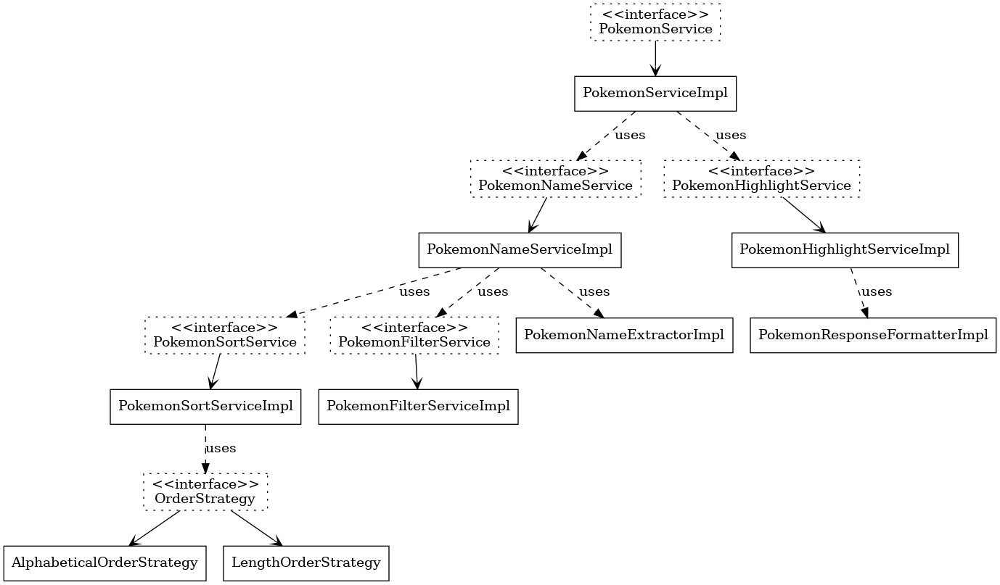

# challenge-looqbox
Desafio de candidatura

Com a licenca para comentarios no codigo-fonte com intuito de explicar meu algoritmo, assim como o desafio pede...

1. Análise de Complexidade do Algoritmo de Classificação
   O Merge Sort é um algoritmo de ordenação eficiente com as seguintes características:

 - Divisão: A lista é dividida recursivamente em duas metades até atingir o caso base de listas unitárias.
 - Mesclagem: As listas unitárias são combinadas de forma ordenada.
 - Complexidade Temporal
   -  Divisão: O array é dividido em duas partes recursivamente, o que leva
𝑂
(
log
⁡
𝑛
)
O(logn).
   -  Mesclagem: Combinar as listas divididas requer
   𝑂
   (
   𝑛
   )
   O(n) para percorrer os elementos.
   - Complexidade Total:
   𝑂
   (
   𝑛
   log
   ⁡
   𝑛
   )
   O(nlogn).
- Complexidade Espacial
  - O Merge Sort requer espaço extra para armazenar as listas divididas, resultando em
  𝑂
  (
  𝑛
  )
  O(n).

- Justificativa
Escolhi Merge Sort porque ele é eficiente para grandes conjuntos de dados e mantém um desempenho consistente mesmo em casos de pior cenário (
𝑂
(
𝑛
log
⁡
𝑛
)
O(nlogn)).

Segue abaixo o design de arquitetura da estrutura dos services, sendo chamado apenas na classe controladora:

